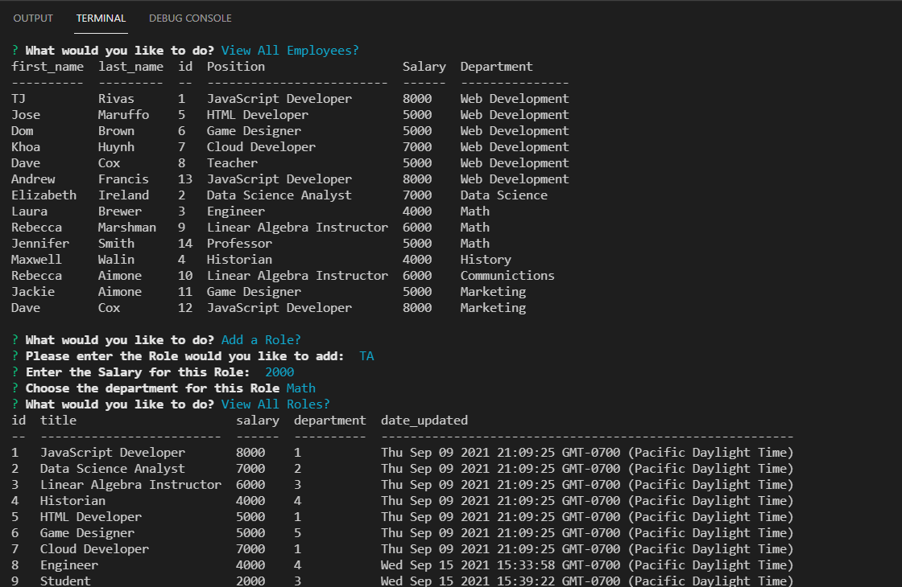

-----------------------------------------

## Table of Contents

* [Title](#Title:)
* [Description](#Description)
    * [Installation](#Installation)
    * [Usage of this project](#Usage_of_this_project)
    * [Who contributed](#Who_contributed)
    * [Features of this program:](#Features_of_this_program:)
* [link to video](#link-to-video)
* [License](#License)
* [Link to GitHub repository](#Link-to-GitHub-repository)
* [picture of page](#picture-of-page:)

-----------------------------------------
------------------------------    
### Title

Content Management System (CMS)

--------------------------------------------------------------------------------
### Description 

This program is a command-line application  to manage a company's employee database, using Node.js, Inquirer, and MySQL.

--------------------------------------------------------------------------------
### Installation

You must install Node.js, npm inquirer, and MySQL.

--------------------------------------------------------------------------------
### Usage of this project

To add employees to a database that will track their position, manager, salary, and department.

--------------------------------------------------------------------------------
### Who contributed

Laura Brewer

---------------------------------------------------------------------------------
### link to video     

https://watch.screencastify.com/v/0KVxrhvyQY1TOIjLhF6V

--------------------------------------------------------------------------------
### License 

This application is covered under the: Mit license.

--------------------------------------------------------------------------------
### Link to GitHub repository 

github\ljbrewer\CMS

--------------------------------------------------------------------------------
### picture of page:

-------------------------------------------------------------------------------
#### Features of this program:

It runs from the command line and it prompts the user to input information about the Employees and their position, department, manager.